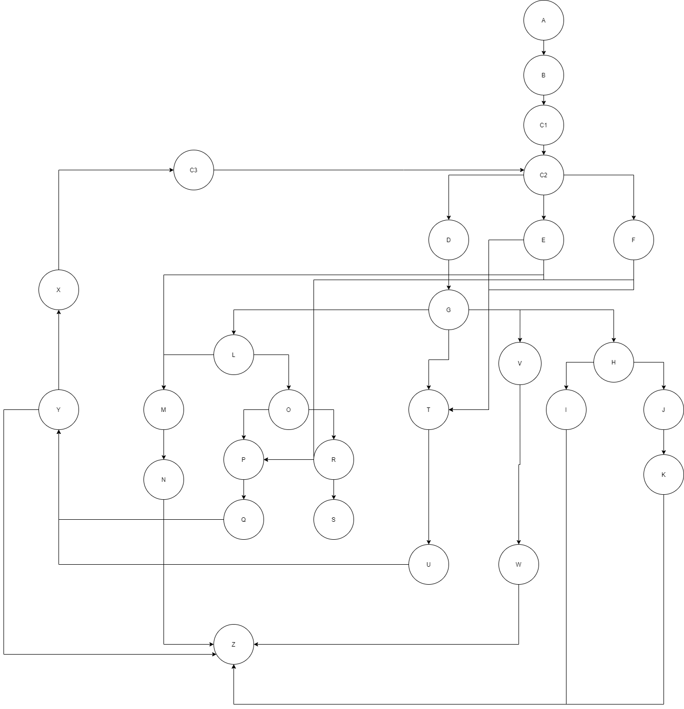

# Втора лабораториска вежба по Софтверско инженерство
## Христијан Томевски Индекс:161178
# Control Flow Graph

### Број на ребра: 36
### Број на јазли: 29
### Број на региони: 6
### Цикломатска комплексност: 6
#
### Графот е нацртан со помош на видеата на courses
